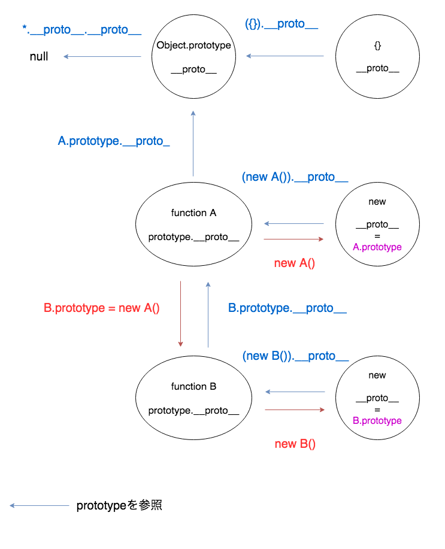

# prototype

## WIP
まだ書きたいこと and わかりづらい部分 があるので一旦wipとします;(  
来週も続ける可能性ありです。  
二時間用の資料になりそう  

## 目次
- [prototypeとは](#prototype-1)
- [`[[Prototype]]` と `prototype` と `__proto__`](#prototype-2)
  - [`[[Prototype]]`](#prototype-3-1)
  - [`prototype`](#prototype-2-2)
  - [`__proto__`](#prototype-2-3)
- [Object.prototype](#prototype-3)
- [プロトタイプチェーン](#prototype-4)
- [プロパティを探す順序](#prototype-5)
- [prototypeをなぜ利用するのか？](#prototype-6)
- [prototypeによりクラスベースのように振る舞う](#prototype-7)

---
## {#prototype-1} prototypeとは
オブジェクトを継承するための概念です。 

---
## {#prototype-2} `[[Prototype]]` と `prototype` と`__proto__`
### {#prototype-2-1} `[[Prototype]]`
すべてのオブジェクト型は内部プロパティである`[[Prototype]]`を持ちます。   
`[[Prototype]]`は別オブジェクトへの参照を管理します。(ない場合はnull)  
そして内部プロパティの実現として `prototype`, `__proto__`を用いて実現させます。 

FYI: [ECMAScript® Language Specification#sec-8.6.2](http://www.ecma-international.org/ecma-262/5.1/#sec-8.6.2)

### {#prototype-2-2} `prototype`
関数オブジェクトが生成されるときに暗黙的に作られるプロパティ。   
`prototype object`とよばれます。  
prototypeはインスタンス間を**共有**する役割があります。  

```javascript
function Hello(word) {
  this.word = word;
  this.say = () => this.word;
}

const hoge = new Hello('Hoge');
const fuga = new Hello('Fuga');
```
もちろん、hogeとgugaは参照先が違うので
```javascript
hoge === fuga // false
```
になりますが、`prototype`はHelloの中で共有されるので
```javascript
hoge.prototype === fuga.prototype // true
```
となります。

つまり、その関数の**ルート**のようなイメージです。  

また、関数オブジェクトしか`prototype`は持ちません。  
```javascript
const obj = {};
const func = function() {};

// prototypeプロパティを持っているかどうか
Reflect.has(obj, 'prototype'); // false
Reflect.has(func, 'prototype') // true
```

`prototype`で定義した変数、関数は暗黙な参照により通常通りのアクセスを可能とします。
```javascript
Hello.prototype.text = 'Hello:)';

const hello = new Hello();

hello.text; // "Hello:)"
```

### {#prototype-2-3} `__proto__`
`Object.prototype`から継承されるアクセサ。  
ブラウザによって実装されている場合とされていない場合があるので注意。(IE11だと`__proto`)  
ES5から入った`Object.create()`を使うことにより、上記の環境依存を回避することができます。   
関数オブジェクトの場合、空のfunctionが入っています。  
```javascript
const obj = {};
obj.__proto__
/* 
  Object {}
    __defineGetter__: __defineGetter__()
    __defineSetter__: __defineSetter__()
    __lookupGetter__: __lookupGetter__()
    __lookupSetter__: __lookupSetter__()
    constructor: Object()
    hasOwnProperty: hasOwnProperty()
    isPrototypeOf: isPrototypeOf()
    propertyIsEnumerable: propertyIsEnumerable()
    toLocaleString: toLocaleString()
    toString: toString()
    valueOf: valueOf()
    get __proto__: get __proto__()
    set __proto__: set __proto__()
*/
obj.prototype
/*
  undefined
*/

const func = function() {};
func.__proto__
/*
  function() {}
*/
func.prototype
/* 
  // prototype に constructor を持ちます
  // Object.prototype.constructor はオブジェクトのプロトタイプを生成する関数への参照を返します
  Object {}
    constructor: ()
    __proto__: Object
*/
```
インスタンス化された時にコンストラクタの `prototype` の参照を生成されたオブジェクトの`__proto__`へ紐付けます。    
```javascript
const hello = new Hello();
// newした時、 hello.__proto__ = Hello.prototype; のように参照を格納する
```

```javascript
const Hello = function() {};

Hello.prototype.text = 'hello:)';

const hello = new Hello();

// newしたのでHelloのprototypeであるtextが__proto__から参照できるようになる
hello.__proto__ // Object {text: "hello:)"}

// objectなのでprototypeを持たない
hello.prototype // undefined

// 参照先が同じかどうか
Hello.prototype === hello.__proto__ // true

hello.text // "hello:)"

// textはhello自身のプロパティではない
// あくまでも__proto__に入っているもの
hello.hasOwnProperty('text') // false
hello.__proto__.hasOwnProperty('text') // true
```

---
## {#prototype-3} Object.prototype
Object オブジェクトはすべてのオブジェクトの元であり、特殊な存在です。  

`Object.prototype`の`__proto__`はnullです。
```javascript
Object.prototype.__proto__
// null
```

`Object.prototype.__proto__`はnullを返し、最終的にここに辿りつき探索を終えるということです。  

例えば以下の場合を見てみましょう。  
```javascript
const num = 1;
num.toString() // "1"
num.word; // undefined
Object.prototype.word = 'hello:)';
num.word // "hello:)"
```
Number型でも`Object.prototype`のプロパティへアクセスできるのは `(New Number())`に変換するボクシングが行われるためです。
FYI: [wrapper object](http://localhost:4000/types/types.html#types-4)  

つまり
```
(new Number()).__proto__.__proto__.word
```
と内部的な探索が行われています。  

このようにどこからでもアクセスできる(undefined, nullを除く)特殊な存在であることがわかります。

---
## {#prototype-4} プロトタイプチェーン
[WIP] 書き直し、`__proto__`を使うという表現は避けたい。`[[Prototype]]`が本当なのと`__proto__`を使うとIEでは嘘になるので本来は`[[Prototype]]`を使うべきかなぁ 
ただ例で`__proto__`を使っているのでここでは`[[Prototype]]`を`__proto__`と定義します。  

`__proto__` を使い実現します。  
オブジェクトが持つ`__proto__`の参照先を辿っていく仕組みをプロトタイプチェーンと呼びます。  
プロトタイプチェーンは目的のプロパティを見つけるか`__proto__`がnullを返すまで探索をします。  
`Object.prototype.__proto__`にはnullが入っているのでここで終了となります。  
なかった場合はundefinedを返します。  

```javascript
const Hello = function() {};

Hello.prototype.text = 'hello:)';

const hello = new Hello();

hello.__proto__ // Object {text: "hello:)"}
hello.__proto__.__proto__ // Object {} 省略します
hello.__proto__.__proto__.__proto__ // null 終了し、なかったらundefinedを返す
```
のように辿って探索する仕組みです。  

```javascript
const Hello = function() {};
const World = function() {};

Hello.prototype.text = 'Hello:)';
World.prototype = new Hello();

Hello.prototype.__proto__ // Object {} [1]
// Helloの参照が__proto__へ格納された
World.prototype.__proto_ // Object {text: "Hello:)"} [2]

// Worldをインスタンス化
const world = new World();

world.__proto__ // Hello {} [1]
world.__proto__.__proto__ // Object {text: "Hello:)"} [2]
world.__proto__.__proto__.__proto__ // Object {}
world.__proto__.__proto__.__proto__.__proto__ // null

// textは `__proto__.__proto__` 時に発見できるのでそこで終了する
world.text // "Hello:)"
```
このように`__proto__`で格納されている参照を見ていきます。  

図にすると以下のようになります。


---
## {#prototype-5} プロパティを探す順序
`そのオブジェクト自身にプロパティが存在するかを調べる -> prototype -> undefined`
の順番で探します。  
なので例えば一部だけそのプロトタイプで定義されたものを使いたくない場合はそのインスタンスのthisに同名のプロパティを指定することによりprototypeで定義された方は呼ばれなくなり上書きすることが可能です。 

---
## {#prototype-6} prototypeをなぜ利用するのか？
何個もその関数オブジェクトをインスタンス生成する場合、共通の値やメソッドがある時にクラスのプロパティとして定義させると同じものが生成分メモリに乗ることになるので非常に非効率です。  
そこで共通なものはprototypeとして定義することにより上記の問題を解決します。

```javascript
/*
 * これだと効率が悪い
function Hello(name) {
  this.name = name;

  // 共通化したい物なので一つで良い
  // 今回このように書くと say が２つ確保されてしまう
  this.say = () => this.name;
}
*/

function Hello(name) {
  this.name = name;
}

// prototypeとして定義する
Hello.prototype.say = function() {
  return this.name;
};

const hoge = new Hello('Hoge');
const fuga = new Hello('Fuga');
```
prototypeに定義された物は`__proto__`の中に定義されます。

`[[Prototype]]`
```javascript
hoge.__proto__ // Hello { say: [Function] }
fuga.__proto__ // Hello { say: [Function] }
```
prototypeに定義された関数を呼び出すには
```javascript
hoge.say(); // Hoge
fuga.say(); // Fuga
```
のようにいつも通り呼び出すことが可能です。

---
## {#prototype-7} prototypeによりクラスベースのように振る舞う
JavaScriptは他の言語と違い、prototypeベースのオブジェクト指向言語です。  

```javascript
function Hello(face) {
  this.face = face;
}

const smile = new Hello(':)');
const cry = new Hello(';(');

Hello.prototype.say = function() {
  console.log(`Hello ${this.face}`);
};

smile.greet(); // Hello :)
cry.greet(); // Hello ;(
```
prototypeを使うことによりこのように扱うことができます。  

---
## まとめ
メソッドや変数でどのインスタンスでも変わらないものはprototypeにいれましょう。  
